[Sunne Dogcare](https://fridalannerstrom.github.io/dogsitter/) is a website designed for a local dog-sitting service based in Sunne, Sweden. The purpose of this project is to provide a professional and user-friendly platform for the business, allowing potential clients to easily explore the available services, get to know the dog sitter, and contact the owner for bookings or inquiries.

The website is designed with a modern, clean aesthetic to present Sunne Dogcare as a professional and trustworthy service. It combines this with a personal touch, using plenty of images and warm visuals to give potential clients a sense of familiarity and trust. It aims to showcase the reliability and trustworthiness of Sunne Dogcare, while also offering all necessary information for dog owners who seek safe and enjoyable care for their pets.  The design follows best practices in web development, offering seamless navigation, readability, and accessibility across all devices.

# Table of content

1. [User Experience (UX)](#user-experience-ux)
   - [Goals](#Goals) 
   - [User Stories](#user-stories) 
   - [Wireframes](#wireframes) 
   - [Graphic Design & Color Scheme](#graphic-design--color-scheme) 
   - [UI/UX Design](#uiux-design) 

2. [Features](#features)
   - [Page Elements](#page-elements)
   - [Key Features](#key-features)
   - [Future Changes](#feature-changes)
   - [Future Features](#future-features)
   
3. [Tools and Technologies](#tools-and-technologies)
   - [Languages](#languages)
   - [Libraries](#libraries)
   - [Development Tools](#development-tools) 
   - [Other Tools](#other-tools)
   
4. [Testing](#testing)
   - [Test Methods](#test-methods) 
   - [Bugs](#bugs) 
   
5. [Deployment](#deployment)
   - [Local Deployment](#local-deployment) 
   - [GitHub Deployment](#github-deployment)
   
6. [Credits and Contact](#credits-and-acknowledgments)
   - [Content & Media](#content-sources)
   - [Other](#contact-information)

---

# User Experience (UX)

## Goals

The goal of Sunne Dogcare is to offer a warm, welcoming, and trustworthy dog-sitting service for dog owners in Sunne and surrounding areas. The website is aimed not only at current dog owners but also at new or potential dog owners who might be looking for a dog-sitting solution before they commit to getting a dog, especially for times when they’re at work or busy.

### Target Group:

- **Dogowners in Sunne and surrounding areas**
- **Soon-to-be dogowners in Sunne and surrounding areas**

### User Goals:

- **Read about services:**  Visitors should easily find details about the services offered, how the process works, and what it costs.
- **Book a service:**  Provide a simple and straightforward way for users to book dog-sitting for their pets.
- **Read about Sunne Dogcare:**  Let users get to know the dog-sitter, the dogs on the property, and what the environment looks like, helping them feel comfortable before making a booking.

### Business Goals:

- **Provide clear information about services:**  Clearly and simply communicate the services offered, making it easy for visitors to understand what Sunne Dogcare provides and how it works.
- **Enable easy booking:**  Ensure that visitors can easily book dog-sitting services.
- **Attract new customers:**  Make the website inviting and informative, especially for new dog owners or first-time visitors, as returning customers are likely already convinced.
- **Build trust:** Create a welcoming and reassuring atmosphere with happy dogs and professional services, so that dog owners feel comfortable and confident leaving their pets with us.

### How Sunne Dogcare achieves these goals:

| Feature | Description | Reinforces goal |
| --------- | --------------------- | -------------- |
| **Personal touch:** | Introduce the dog-sitter right away with personal photos, also a personal about page introducing the farm and animals, and social media | *Build trust* and *Read about Sunne Dogcare* |
| **Gallery of happy dogs:** | Showcase happy dogs in a gallery to highlight the positive environment | *Attract new customers* |
| **Simplify services:** | Focus on just three clear, easy-to-book services to avoid overwhelming users | *Enable easy booking* and *Read about services* |
| **Clear service information:** | Use bullet points to present services with clear descriptions and pricing. Link to service page reappears in several places | *Provide clear information about services* and *Read about services* |
| **Visual aids:** | Use icons to make information easy to understand and visually engaging | *Provide clear information about services* and *Read about Sunne Dogcare* |
| **Easy booking page:** | A dedicated booking page with minimal fields makes booking quick and simple. | *Enable easy booking* and *Book a service* |
| **Light, natural colors:** | Use warm, natural colors to create a friendly, rural feel, matching the environment | *Build trust* |

## User Stories
1. **As a dog owner,** I want to easily find information about the different dog-sitting services available, so I can choose the best option for my dog.
2. **As a potential dog owner,** I want to learn about the dog-sitter and see photos of the farm, so I can feel confident that I have a reliable dog-sitting solution in place before deciding to get a dog.
3. **As a busy dog owner,** I want a simple and clear booking process, so I can quickly schedule dog-sitting without filling out unnecessary forms.
4. **As a first-time visitor to the site,** I want to see the happy and welcoming environment through photos and descriptions, so I feel reassured about leaving my dog in good hands.
5. **As a returning customer,** I want easy access to the booking page, so I can quickly schedule a service I already know and trust.
6. **As a dog owner,** I want to clearly see the prices for each service, so I can plan my budget without surprises.
7. **As a dog owner,** I want to follow the dog-sitter’s social media to stay updated on the services and see more of the dogs being cared for, so I can feel connected to the service.
8. **As a dog owner,** I want to feel confident that my dog is in safe hands, so I can relax knowing they are well cared for while I'm away.

## Wireframes
Wireframes were created using Adobe XD, with a strong focus on the user goals, business goals, and user stories. These wireframes serve as the foundation for the design and structure of the website.

  
📱 Click to view Mobile Wireframes

  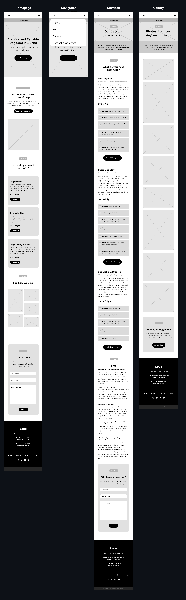
  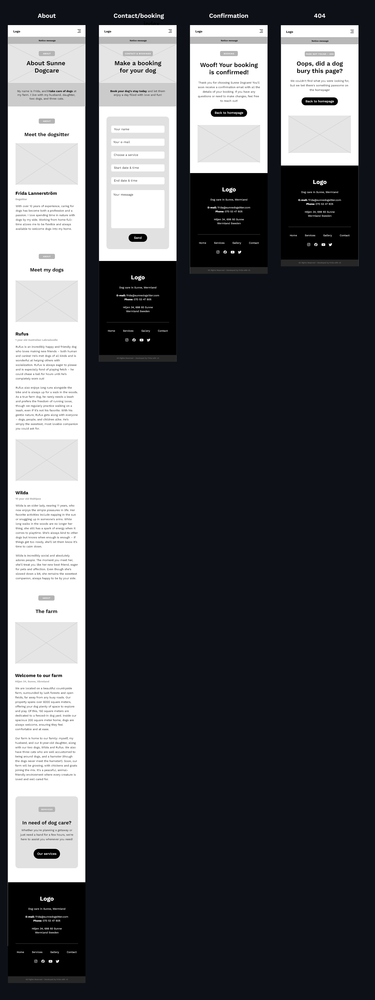

  
💻 Click to view Tablet Wireframes

  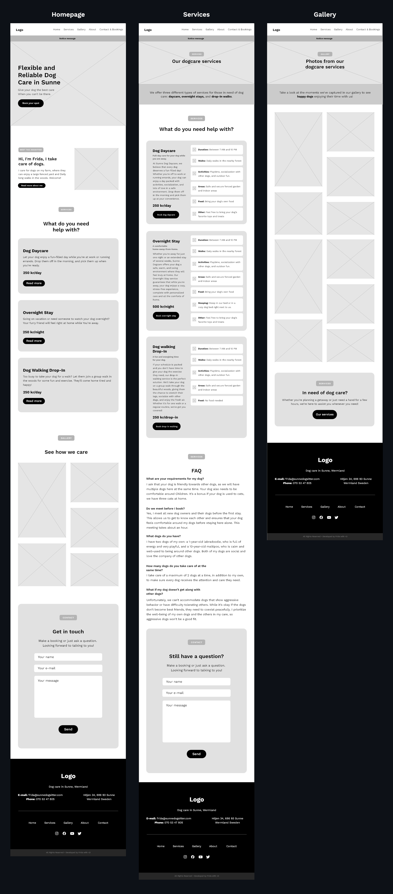
  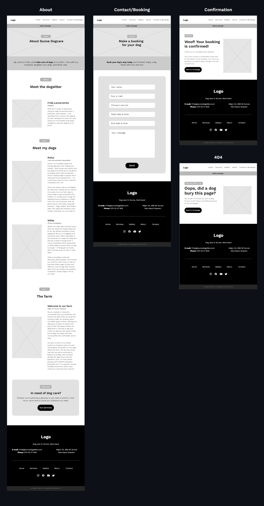
  

  
🖥️ Click to view Desktop Wireframes

  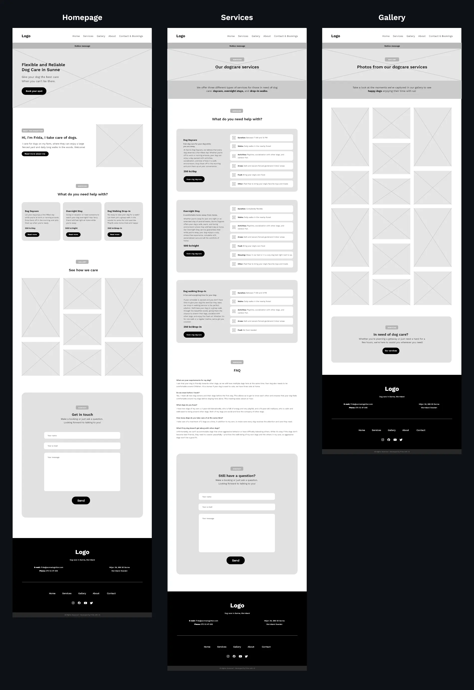
  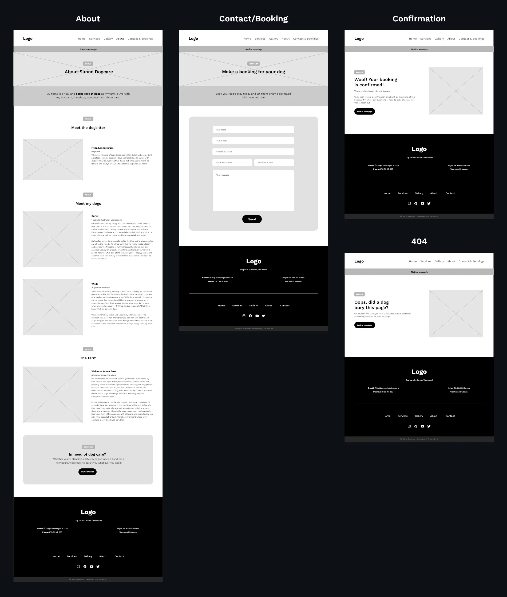

## Graphic Design & Color Scheme
The design, fonts, and media are all focused on creating a warm, trustworthy feel that reflects nature and the calm of the surrounding forest. The goal is to make the user feel secure and confident in the services, while keeping things professional. At the same time, the design ensures that the message is clear and easy to take in quickly, so users can find what they need without any hassle.

### Colors

- **Primary Color:** The design primarily uses three shades of green as the main color. Green was chosen for its strong association with nature, conveying a sense of calm and reliability —q ualities that align well with the values of a dog-sitting service in a rural setting. Additionally, green represents safety and harmony, which are qualities that Sunne Dogcare wants to convey to its users.
- **Secondary Color:** A warm, light color is used as the secondary color to add warmth to the design. This shade leans towards orange, a color often linked with happiness and positivity, which complements the joyful and caring atmosphere of the business.
- **Base Colors:** Black and white are employed as the base colors. Black adds contrast and elegance, helping to ground the design and highlight key elements, while white brings clarity and simplicity, ensuring that the overall message is clear and easy to read. 

Together, these colors create a balanced and professional look, enhancing the user experience without overwhelming the content.

  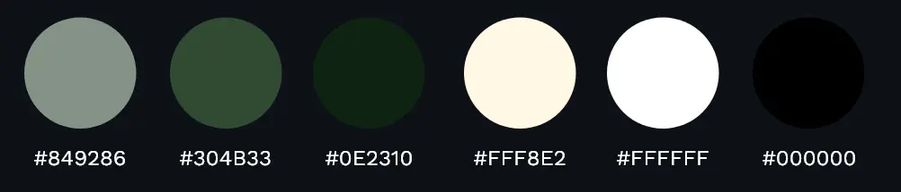

### Fonts

#### Fonts choosen
- **Lora** for headings – a serif font that conveys a professional and trustworthy impression, adding a sense of seriousness and reliability to the site. 
- **Work Sans** for paragraph text – a basic and modern sans-serif font chosen for its readability, particularly on screens and smaller devices.

By combining a serif and a sans-serif font, the design achieves a balanced look that feels both professional and approachable, as well as inviting and personal. These two fonts complement each other well, enhancing the overall user experience.

#### Fonts styling

- **Lora** for headings (H1, H2)
- **Work Sans** for paragraphs and H3 (Work Sans used instead of Lora for H3 due to better readability).
- **Highlighted text** is Work Sans in bold green
- **Topic Tag**, to help users quickly identify content, has a green background and light, uppercase text in Work Sans.
- **Links** are underlined in green with arrow icon.
- **CTA Buttons** come in two styles: Light, with white background and black text, and Dark, with green background and white text. Both light and dark have the same hover style.

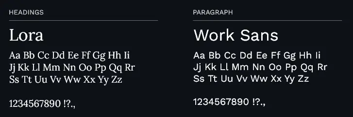

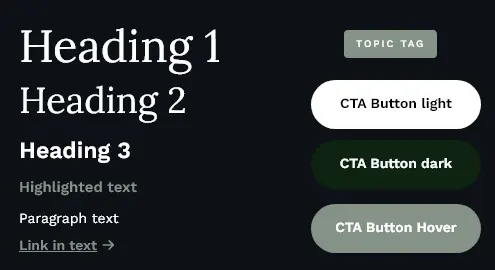

### Logotype
The logo for Sunne Dogcare uses the font [Hot Mess by Sam Parrett](https://www.behance.net/gallery/79231099/Hot-Mess-SVG-Font). This slightly messy, handwritten font was chosen to create a contrast with the otherwise clean and polished design of the brand. The playful, informal style of the font reflects the more unpredictable and sometimes chaotic nature of dog-sitting, making it a fitting choice for the brand.

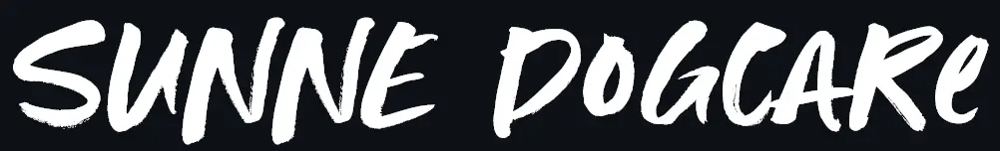

### Icons

The icons used throughout the design are from [Font Awesome](https://fontawesome.com/) in the bold solid style. Icons are an important part of the branding, as they help convey messages in a simpler and more visual way. The icons chosen are closely associated with dogs and nature, such as a bone, paw print, and forest.

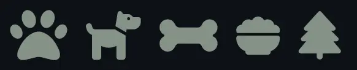

### Media

The images used on the site will focus on dogs highlighting themes of nature, forest, warmth, and joy. The photos will predominantly feature green and natural bright tones to align with the overall design, avoiding sharp or overly bright colors. Warm, earthy hues will be prioritized to create a welcoming and soothing atmosphere, reinforcing the connection to the countryside and the caring environment that Sunne Dogcare offers. All images will have rounded borders to create a softer and more welcoming feel.

The images are sourced from [Unsplash](https://unsplash.com/) via an Unsplash+ subscription.

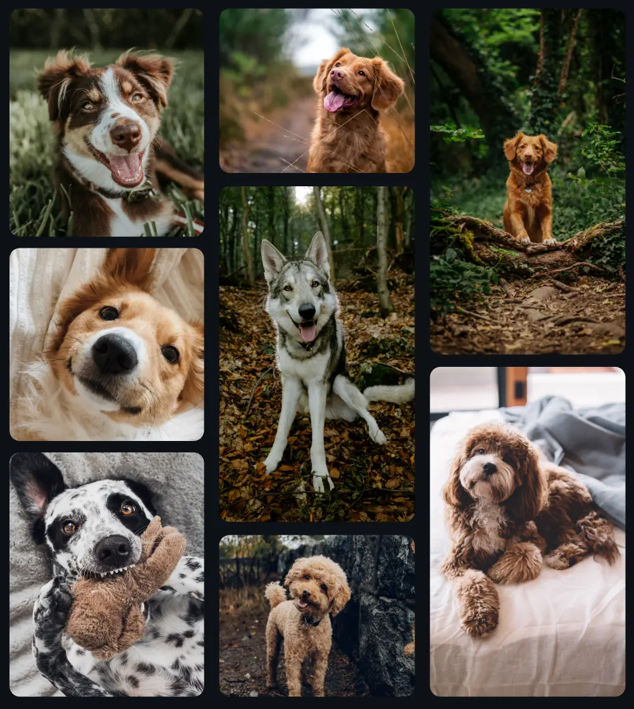

Additionally, some background images are used with a subtle green overlay.

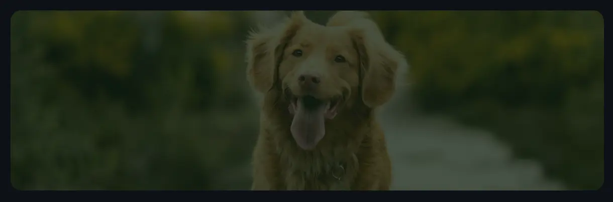

## UI/UX Design

  
📱 Click to view Mobile UI

  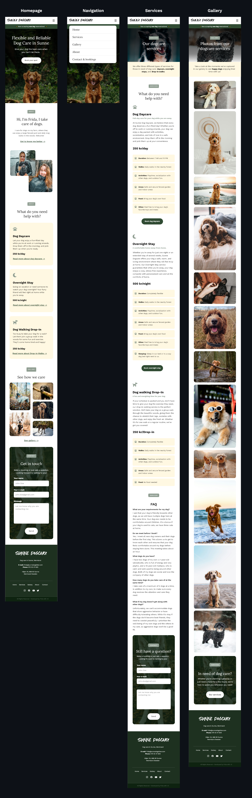
  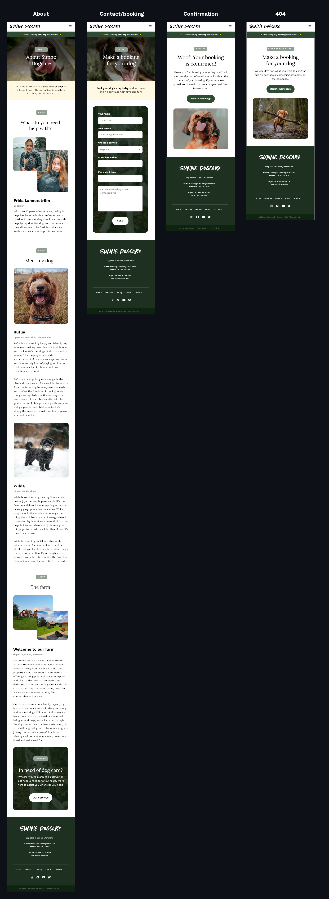

  
💻 Click to view Tablet UI

  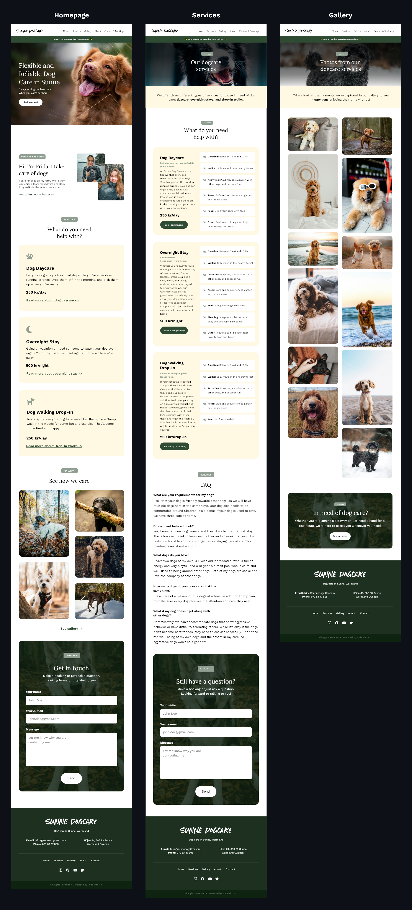
  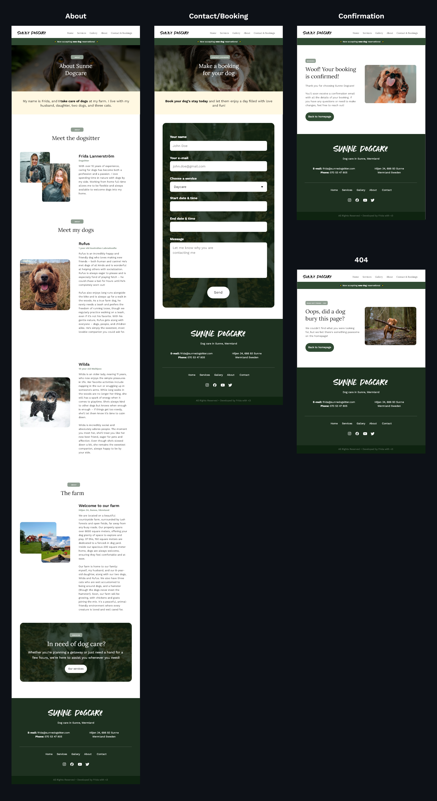

  
🖥️ Click to view Desktop Wireframes

  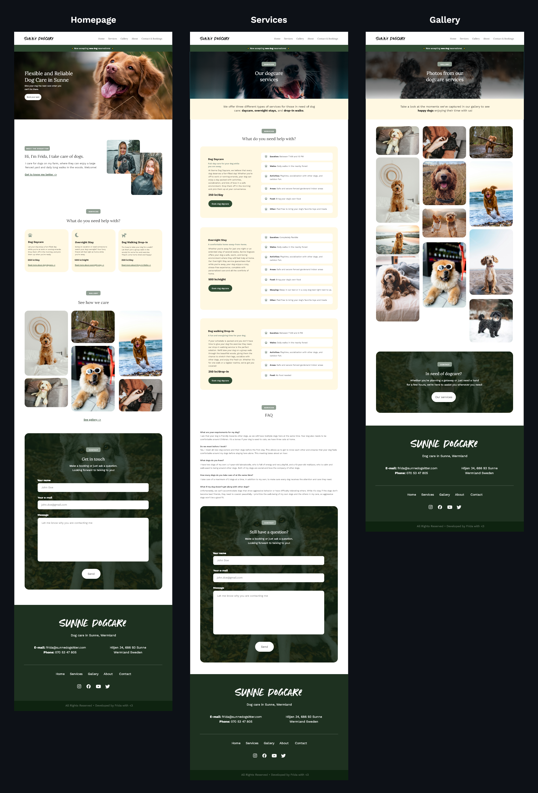
  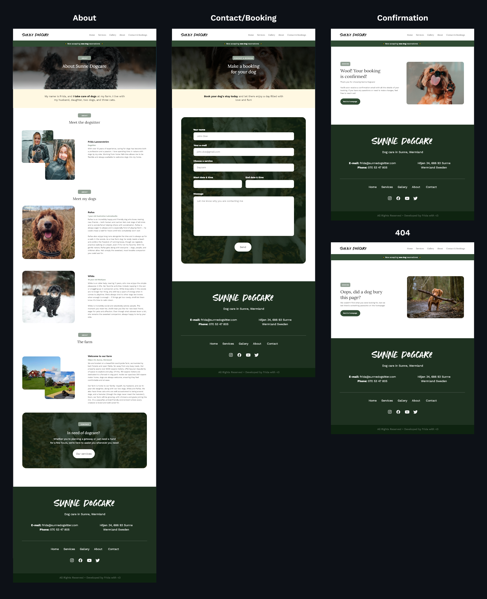

---

# Features

## Page Elements
Brief explanation of the main elements used on the pages (e.g., header, navigation, footer).

## Key Features
Highlight the core features that were implemented and why they are important for the user and business goals (services, booking form, gallery).

## Feature Changes
Changes to the design; service page design with lighter box on desktop, list in about me page

## Future Features
A list of potential features that could be implemented in future versions of the website (Availability Calendar, Review and Rating System, Live Chat for Customer Support).

---

## Tools and Technologies

### Languages
List the programming languages used for the project (only HTML, CSS).

### Libraries
Reference external libraries or tools used in the project (Font Awesome, Google Fonts).

### Development Tools
Note the tools used during development (Git, GitHub, GitHub Pages, Gitpod).

### Other Tools
Favicon generator, mockup generator, Adobe XD.

---

## Testing

### Test Methods
HTML/CSS validator, link checker, test browsers, test responsiveness, pageview insights, user stories.

### Bugs
Detail any bugs encountered during development, how they were resolved, and unresolved bugs (contrast issues, H3 before H2, aria-label missing).

### Features
contact form removal for simpler contact, list in about section to showcase myself more, contact information in contact page. 

---

## Deployment

### Local Deployment
Instructions for setting up and deploying the project locally.

### GitHub Deployment
Explain the GitHub Pages deployment process and provide instructions on how to find the live site.

---

## Credits and Contact

### Content & Media
Unsplash, CloudConvert, Font Awesome, Google Fonts, W3Schools, ChatGPT, Conventional Commits, Hot Mess logo font.

### Other
Code Institute, love runners project. Rory.
